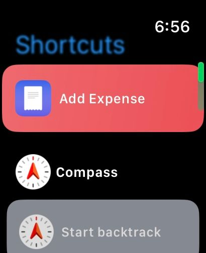

# Add Expense from Apple Watch

The shortcuts from Expenses are compatible with Apple Watch, so you can add an expense from your Apple Watch.

To learn more, please see [Use Shortcuts on your Apple Watch](https://support.apple.com/guide/watch/use-shortcuts-apd99050d435/watchos).


