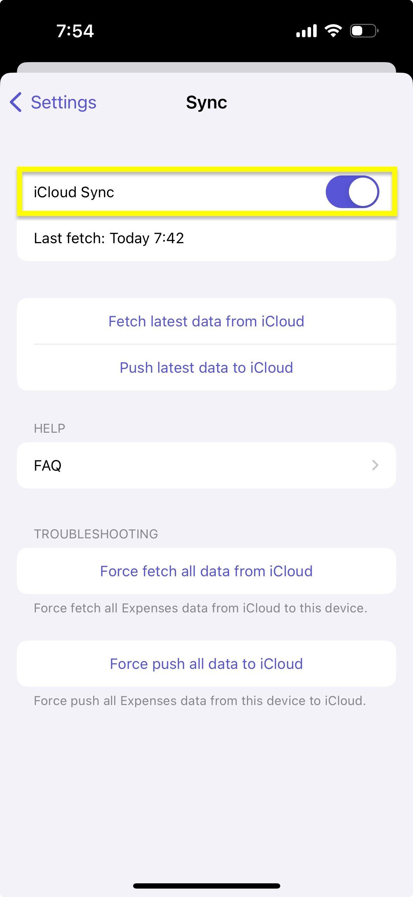
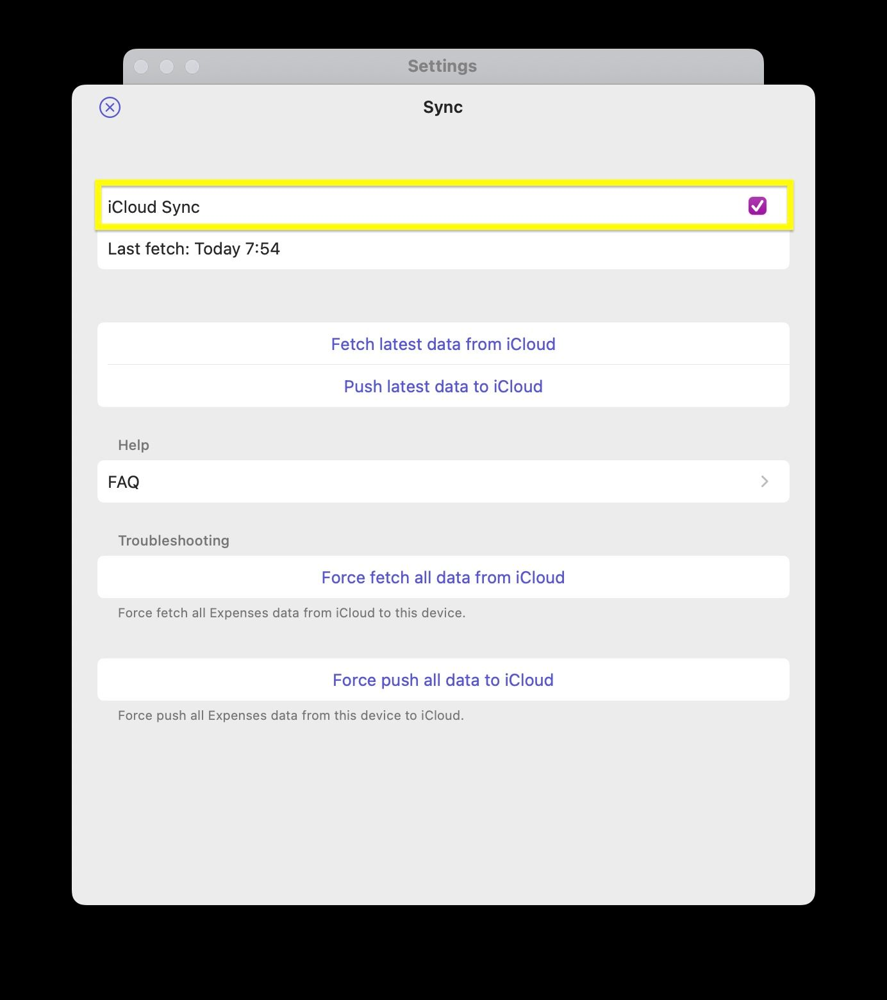

# Enable iCloud Sync

We rely on iCloud to sync data. If the iCloud Sync option is disabled in the app, it means the app can't access your iCloud account on your device for some reason (Technically, we're checking if your iCloud account is available via [CKAccountStatus](https://developer.apple.com/documentation/cloudkit/ckaccountstatus)). To enable it, please check the following.

- [iOS/iPadOS](#iosipados)
- [macOS](#macos)

---

## iOS/iPadOS

1. Turn on iCloud Drive (or the Documents & Data feature) on your iCloud account

    

2. Go to `Settings (System)` → `Apple ID` → `iCloud` → `Show All` and make sure that you check `Expenses`

    

3. Relaunch the app to properly reflect the change
4. Make sure that you select the checkbox to enable iCloud Sync

    

## macOS

1. Turn on iCloud Drive (or the Documents & Data feature) on your iCloud account

    

2. Go to `System Settings (System)` → `Apple ID` → `iCloud Drive (Documents)` and make sure that you check `Expenses`

    

3. Relaunch the app to properly reflect the change
4. Make sure that you select the checkbox to enable iCloud Sync

    

If it still doesn't work, please check the following just in case.

- Check [Troubleshooting iCloud Sync](/faq/troubleshooting-icloud-sync)
- [Sign out of iCloud on your device](https://support.apple.com/en-us/HT208242) and sign in to iCloud again
- See if there is any error or warning on your iCloud account
- Check if parental controls, device management, or incomplete setup for two-factor authentication might deny access to iCloud account credentials
- Restart your device or reinstall the app


