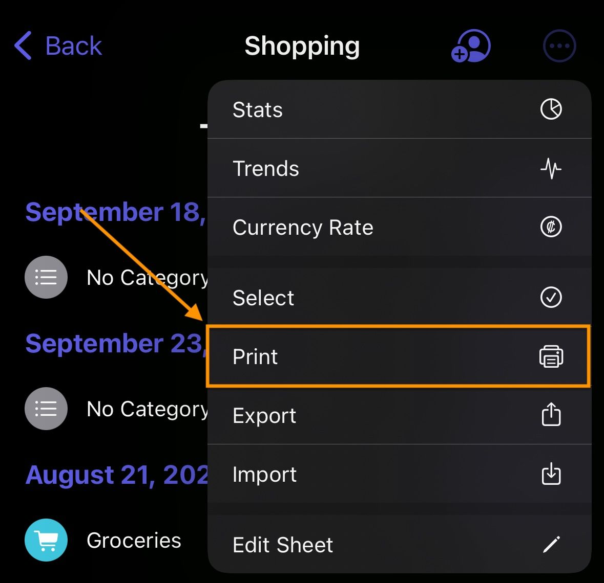
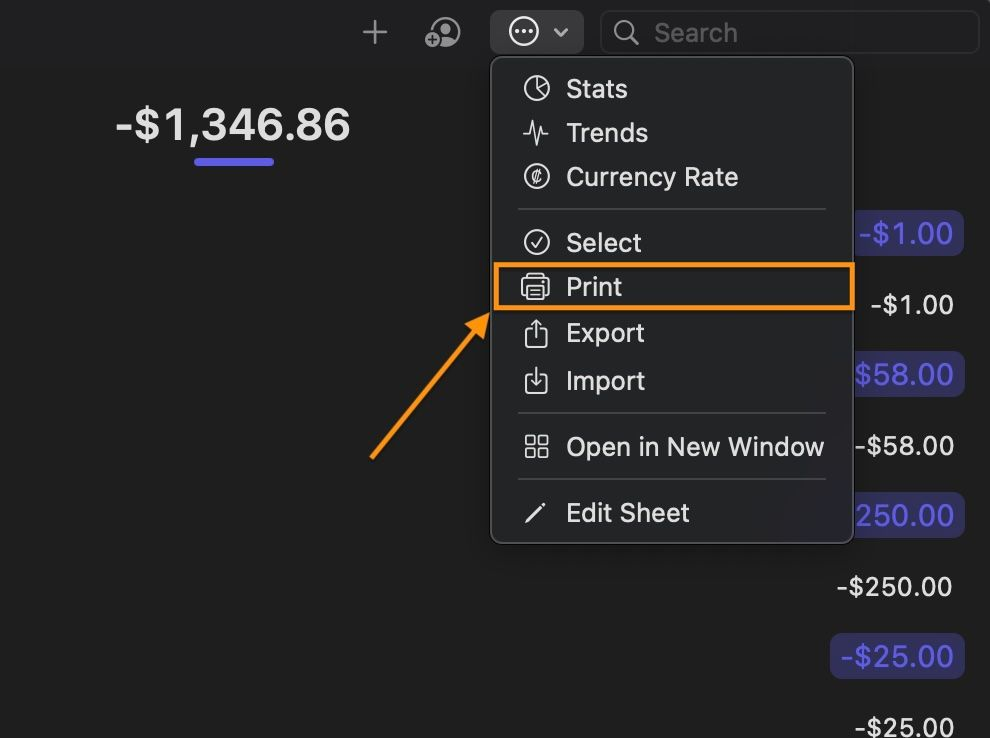
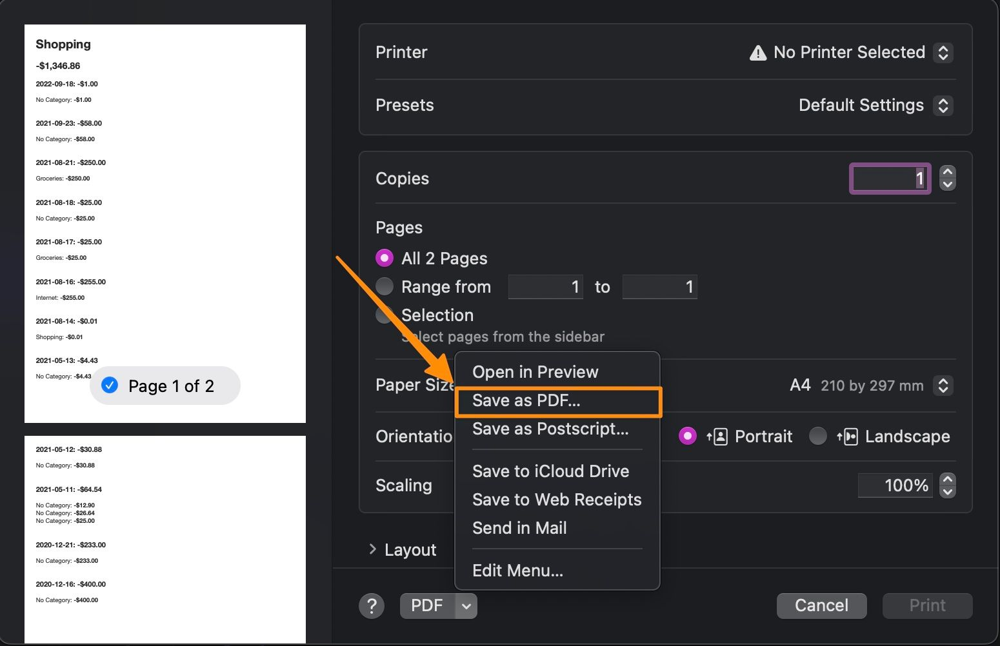

# Export sheet as PDF

You can export your sheet as a PDF file. To do this, follow these steps:

1. Open the sheet you want to export.
2. Tap the `Print` button.

    <table>
        <tr>
            <td>iOS</td>
            <td>macOS</td>
        </tr>
        <tr>
            <td style="vertical-align:top"></td>
            <td style="vertical-align:top"></td>
        </tr>
    </table>

3. Select `Save as PDF` button via the `Share` menu.

    <table>
        <tr>
        <td>iOS</td>
        <td>macOS</td>
        </tr>
        <tr>
            <td style="vertical-align:top"></td>
            <td style="vertical-align:top"></td>
        </tr>
    </table>
