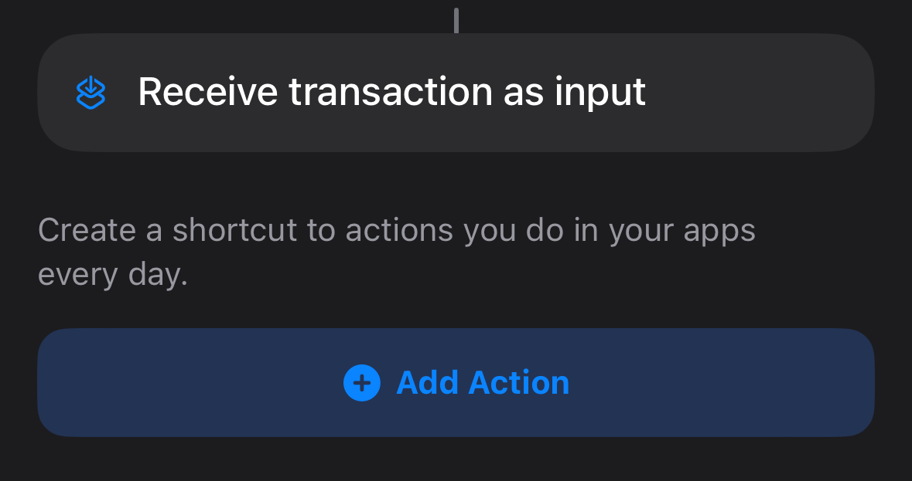
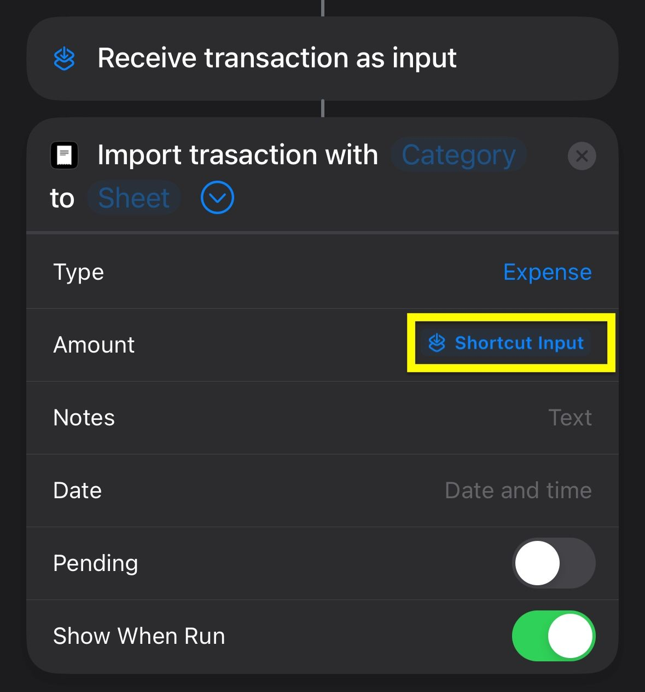
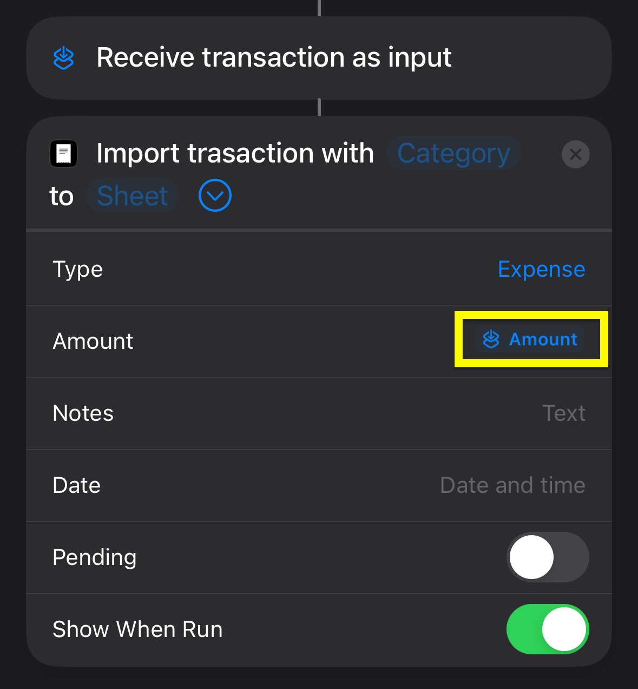
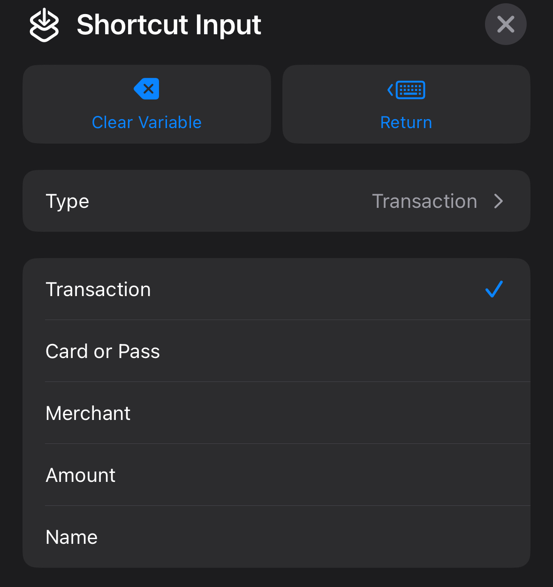

# Import Transaction from Wallet

You can import transactions from Transaction Trigger via your Apple Wallet. Please follow the steps below:

1. Go to the "Automation" tab in the Apple Shortcuts app
2. Tap the "+" button to create a new automation
3. Select the "Transaction" and set up "When I tap" (Select a card to trigger an automation whenever it’s tapped)
4. Tap the "Next" and go to "New Blank Automation"
5. Add "Import transaction" action from Exepnses

    

6. Edit "Amount" (Text) and add "Shortcut Input" from the "Variables" section

    

7. Tap the "Shortcut Input" and select "Amount" from the input list

    

8. Edit other parameters if needed (E.g., add "Marchant" from the "Shortcut Input" section to the Notes field)

    

9. Tap the "Done" button to create the automation


