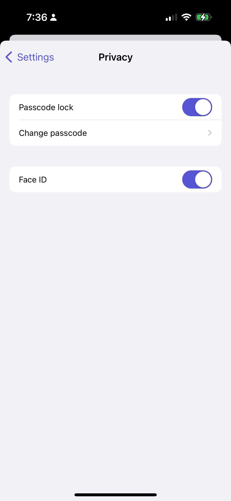
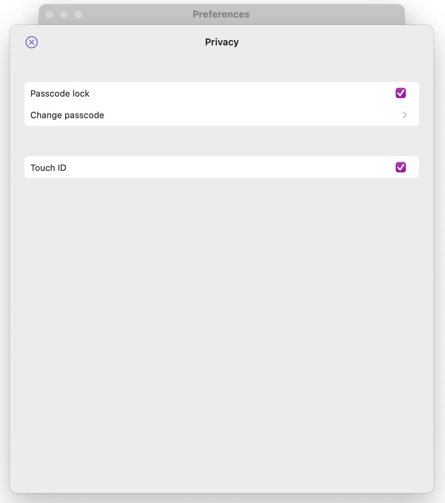
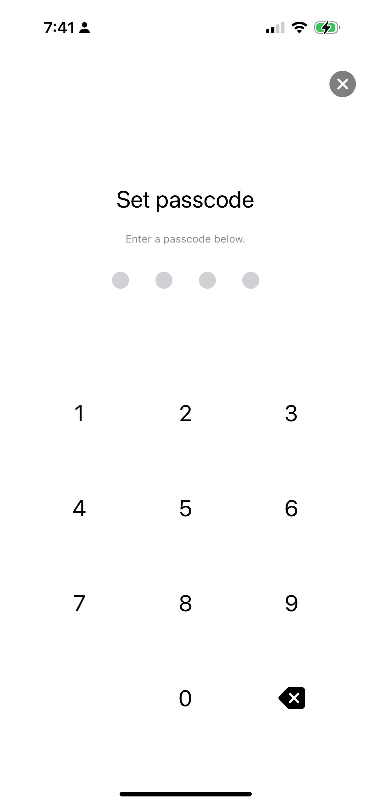
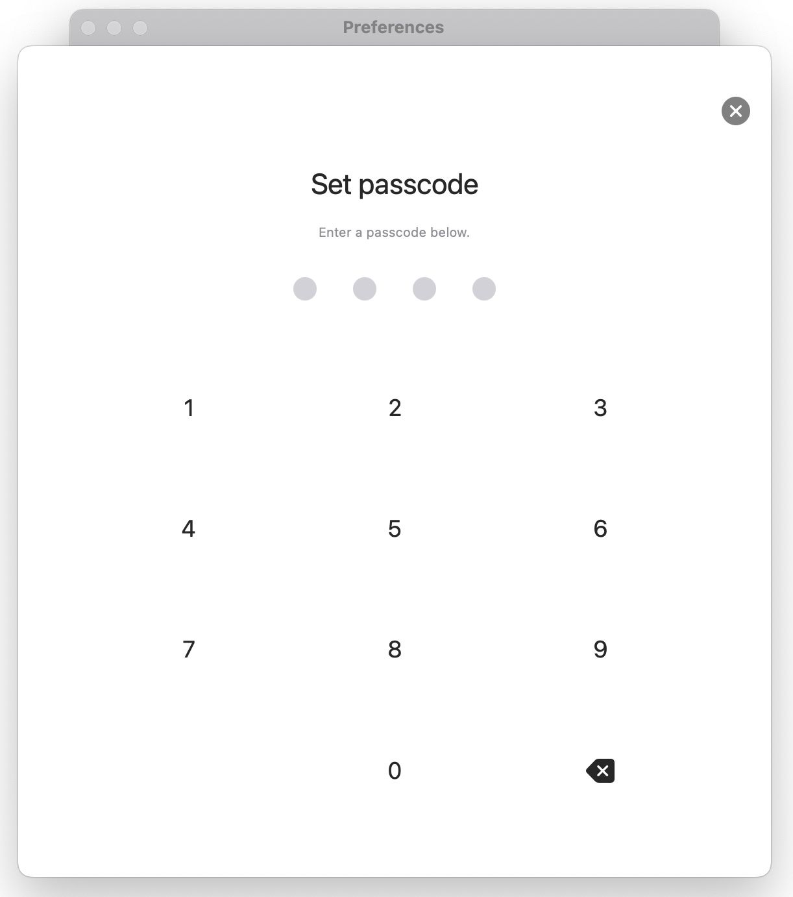

# Passcode lock

The app supports passcode lock. To enable it, go to `Settings > Privacy`.

You will be asked to enter a passcode. After that, you will be asked to confirm the passcode. If you enter the same passcode, the passcode lock will be enabled. If you enter a different passcode, you will be asked to enter the passcode again.

Note that you won't be asked to enter the passcode when the app is running in the background. To enable it, make sure that you close the app. For more information, see [iOS: How to close an app](https://support.apple.com/en-us/HT201330).


