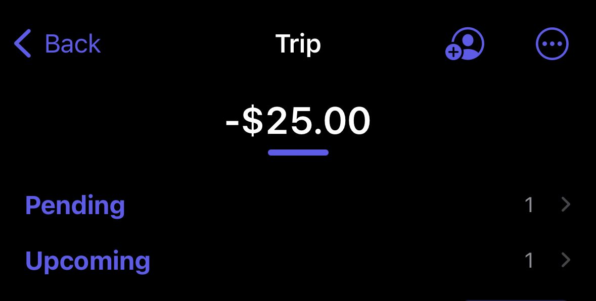

# Pending

You can mark expense/income as pending. Pending expense/income will be excluded from the total amount including Stats and will be displayed in the pending section.
Pending can be used when an actual payment is done later, and you want to keep it as pending until the payment is done.

<table>
    <tr>
        <td>iOS</td>
        <td>macOS</td>
    </tr>
    <tr>
        <td style="vertical-align:top"></td>
        <td style="vertical-align:top"></td>
    </tr>
</table>
