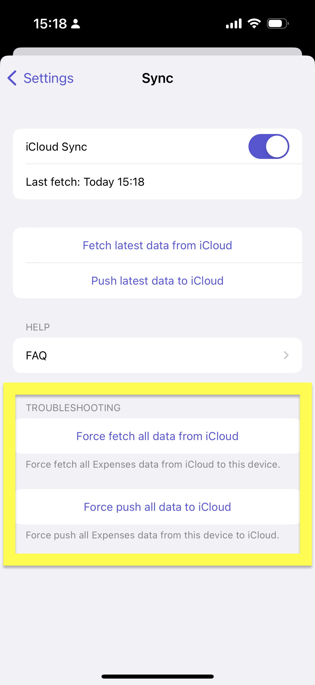
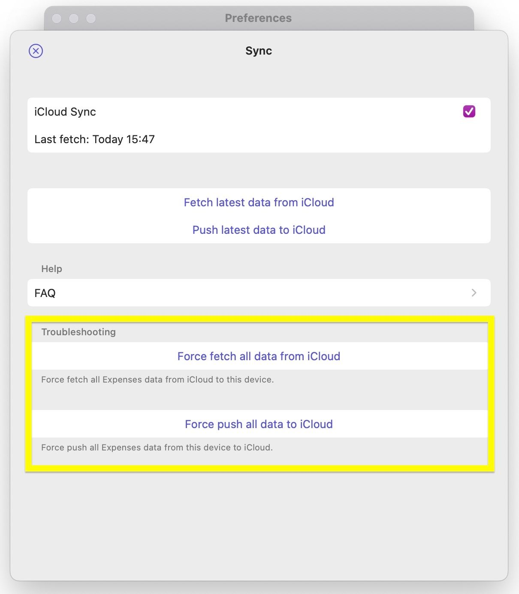

# Troubleshooting iCloud Sync

First, please make sure that you use the same iCloud account on both iOS/iPadOS and macOS and have enough iCloud storage on both. Also, please ensure that you use the latest version of the app. If it still doesn't work, please do the following troubleshooting.

If you can't enable iCloud Sync, please check [Enabling iCloud Sync](/faq/enabling-icloud-sync).

- [iOS/iPadOS](#iosipados)
- [macOS](#macos)

---

## iOS/iPadOS

1. Go to `Settings (Expenses)` → `Sync`
2. Make sure that you select the checkbox to enable iCloud Sync
3. Click `Force push all data to iCloud`
4. Click `Fetch all data from iCloud`
5. Check if the data is synced

## macOS

1. Go to `Settings... (Expenses)` → `Sync`
2. Make sure that you select the checkbox to enable iCloud Sync
3. Click `Force push all data to iCloud`
4. Click `Fetch all data from iCloud`
5. Check if the data is synced

Sometimes, there is something wrong with the Apple System. Please also check [the status page](https://www.apple.com/support/systemstatus/) just in case.


