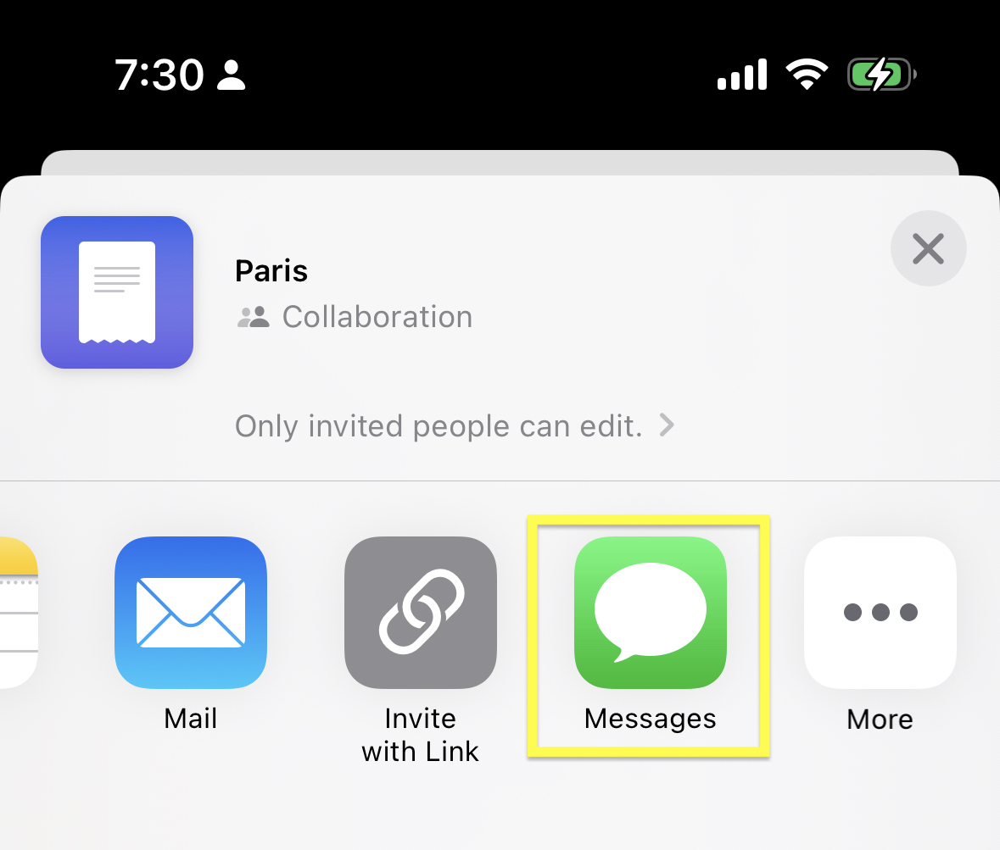
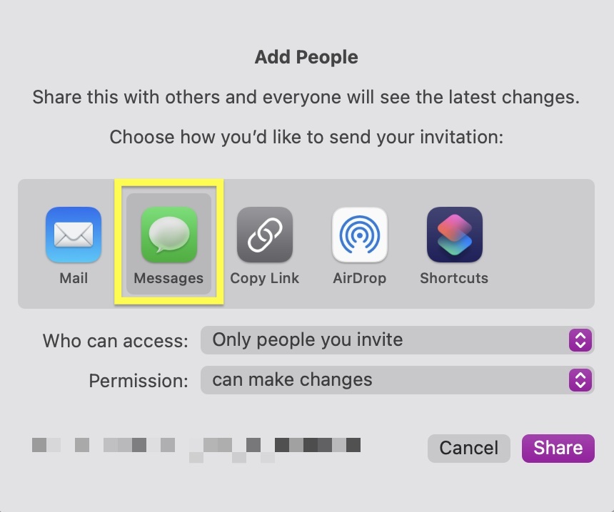

# Troubleshooting Sharing Link

If you can't get a sharing link (e.g., nothing happens when trying to generate the link) when you try to share the link with others, please check the following:

- Make sure you turn on iCloud Drive (See also [Enable iCloud Sync](/faq/enable-icloud-sync))

- Use Messages app from Apple so that opening the link will take you to the Expenses app automatically

    <table>
        <tr>
            <td>iOS</td>
            <td>macOS</td>
        </tr>
        <tr>
            <td style="vertical-align:top"></td>
            <td style="vertical-align:top"></td>
        </tr>
    </table>

- Make sure the link hasn't expired (it'll expire after 30 days)
- Make sure you both already purchased "Expenses Pro"
- It might be a temporary issue on iCloud. Please try again later (Usually, it takes a few hours to be able to generate the link)


