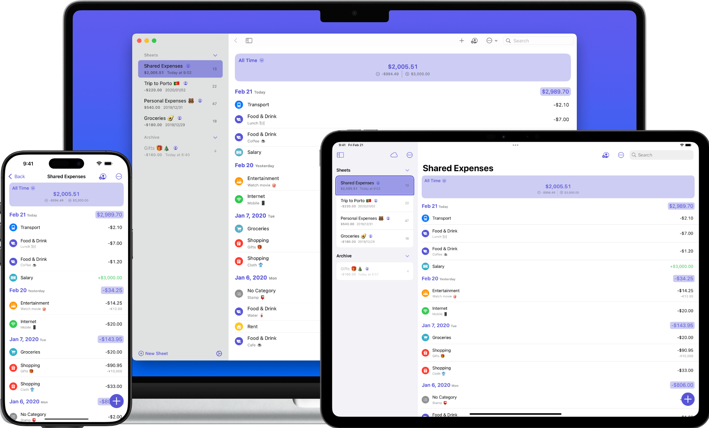

    <picture>
      <source srcset="../assets/expenses-dark.png" width="100%" media="(prefers-color-scheme: dark)">
      
    </picture>
    <h1>Expenses</h1>
    
<b>Expenses</b> has been crafted to <b>keep track of your spending effortlessly</b>, with useful features in a
        simple, intuitive interface. And with iCloud, it’s easy to <b>keep all your expenses in sync </b>across your
        devices and <b>collaborate with others</b> using sharing. The apps are available on Mac, iPhone, iPad, and Apple Vision.

    <a style="text-decoration:none" href="{{ site.links.app_store }}" target="_blank">
        <picture>
            <source srcset="../assets/app-store-badge-dark.svg" media="(prefers-color-scheme: dark)">
            
        </picture>
    </a>
    <a style="text-decoration:none" href="{{ site.links.app_store }}" target="_blank">
        <picture>
            <source srcset="../assets/mac-app-store-badge-dark.svg" media="(prefers-color-scheme: dark)">
            
        </picture>
    </a>
    

        <a href="https://www.producthunt.com/posts/expenses-spending-tracker?utm_source=badge-featured&utm_medium=badge&utm_souce=badge-expenses-spending-tracker" target="_blank">
            <picture>
                <source srcset="https://api.producthunt.com/widgets/embed-image/v1/featured.svg?post_id=202478&theme=dark" alt="Expenses: Spending Tracker - Keep track of your spending effortlessly. | Product Hunt" style="width: 250px; height: 54px;" width="250" height="54" media="(prefers-color-scheme: dark)">
                
            </picture>
        </a>
    

    

        <setapp-custom-banner
            iconUrl="https://store.setapp.com/app/521/7726/icon-1679217546-6416d38ac6eaa.png"
            appName="Expenses"
            appId="521"
            vendorId="345">
        </setapp-custom-banner>
    

    

        

            <h2>Privacy</h2>
            
We care about your privacy seriously. The app requires no registration and no personal data. We don't collect any data.

        

        

            <h2>Accessibility</h2>
            
The app is designed to be accessible to everyone, including those with special needs by providing built-in
                accessibility features.

        

    

    

        

            <h2>Stats & Trends</h2>
            
Stats will show you an overview of your spending. Trends will tell you outstanding changes on your spending over time to help you spend better.

        

        

            <h2>All currencies</h2>
            
The app supports all currencies you may need especially when traveling. It also supports customizable currency rates for major currencies.

        

    

    

        

            <h2>And more...</h2>
            
Shortcuts, Widget, iCloud Sharing, Dark Mode, Multiple Windows, and so forth.

        

    

